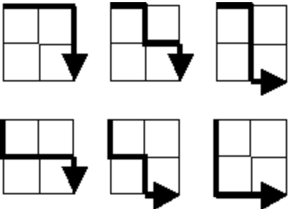

# Project Euler: Problem 15

# `Lattice paths`

## Problem Description

Starting in the top-left corner of a 2×2 grid, and only being able to move to the right and down, there are exactly 6 routes to the bottom-right corner.

How many such routes are there through a 20×20 grid?

## Approach

To solve this problem, we can use combinatorics. The number of routes through a grid of size n x m is given by the binomial coefficient (n + m) choose n. This can be calculated using the formula:

\[ \binom{n + m}{n} = \frac{(n + m)!}{n! \cdot m!} \]

In the context of this problem, where n = m = 20, we can find the solution by evaluating the above expression.

## Instructions

To find the solution to this problem, you can use any programming language of your choice. Implement the approach described above in your preferred language to calculate the number of routes through a 20×20 grid.

## Resources

- [Binomial Coefficient](https://en.wikipedia.org/wiki/Binomial_coefficient)
- [Project Euler Problem 15](https://projecteuler.net/problem=15)
